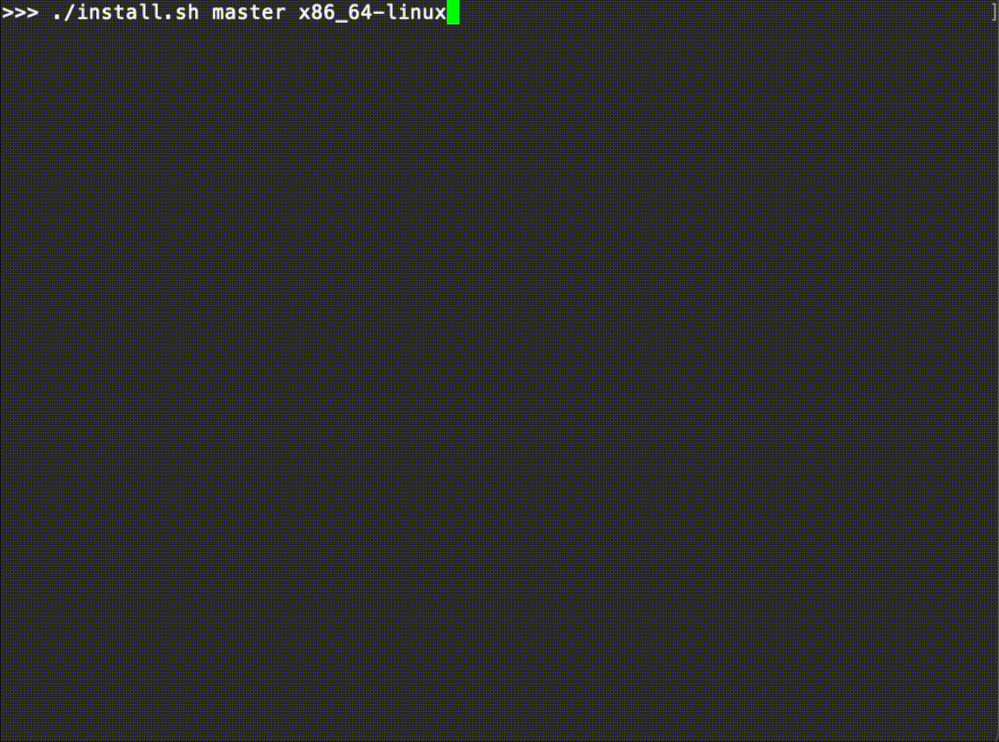

# Zig Install

> Use Zig in GitHub Actions.



## Examples

1. Compile and test a project

```
---
jobs:
  test:
    strategy:
      matrix:
        os: [ubuntu-latest]
    runs-on: ${{ matrix.os }}
    steps:
      - name: Checkout
        uses: actions/checkout@v3
      - uses: shavit/zig-install-action@v0.1.0
      - name: Run tests
        run: |
          zig build test
```

2. Install a specific build
```
$ . install.sh master x86_64-linux
```

```
Usage: install.sh [version] [flavour]

Version:

master
0.9.1
0.9.0
0.8.1
0.8.0
0.7.1
0.7.0
0.6.0
0.5.0
0.4.0
0.3.0
0.2.0
0.10.1
0.10.0
0.1.1

Flavour:

x86_64-macos
aarch64-macos
x86_64-linux
aarch64-linux
riscv64-linux
powerpc64le-linux
powerpc-linux
x86-linux
x86_64-windows
aarch64-windows
x86-windows
```
